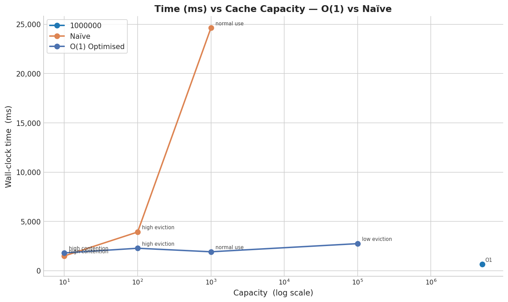
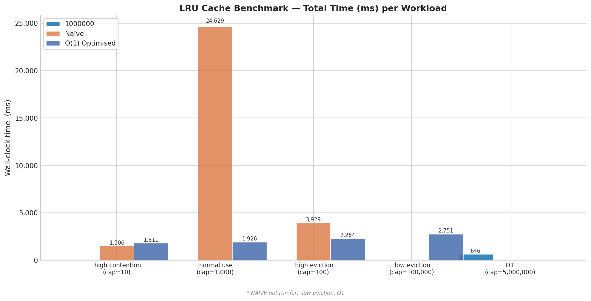

# Buffer Pool and LRU — C++ Implementation

A **Buffer Pool** implemented in C++ using a **Doubly Linked List** + **Hash Map** for O(1) `pin`, `get`, and `unpin` operations — modelled after real database buffer pool managers.

### Benchmark time with capacity -- Compare between Naive LRU and optimized LRU


### Benchmark time in ms -- Compare between Naive LRU and optimized LRU


### More benchmark results in 
[LRU Benchmark](./benchmark/)

---

## How It Works

### Data Structures
- **Main Doubly Linked List** — tracks LRU order of all pages
- **Unpinned Doubly Linked List** — tracks only evictable (unpinned) pages
- **`unordered_map`** — O(1) key → page pointer lookup
- **`unpinned_map`** — O(1) key → unpinned page pointer lookup

### Visualize

```
Main list (LRU order):
head -- [MRU] -- page -- page -- [LRU] -- tail
  ↑                                          ↑
always here                            always here

Unpinned list (eviction candidates):
uhead -- [MRU unpinned] -- page -- [LRU unpinned] -- utail
```

- Every `pin()` or `get()` → page moves to **front** (MRU)
- When cache is full → **LRU page** from main list is evicted
- `unpin()` marks a page as evictable and tracks it in the unpinned list
- Pinned pages are **never evicted**

### API

| Method | Description |
|---|---|
| `pin(key, value)` | Insert or update a page, mark as pinned (not evictable) |
| `get(key)` | Read a page, move to MRU. Returns `-1` if not found |
| `unpin(page*)` | Mark a page as evictable |

### Complexity

| Operation | Time | Space |
|---|---|---|
| `get(key)` | O(1) | O(1) |
| `pin(key, value)` | O(1) | O(n) |
| `unpin(page*)` | O(1) | O(1) |

---

## Prerequisites

```bash
cmake
g++ (C++20 or higher)
```

---

## How to Compile and Run

```bash
bash scripts/compile.sh
```

## How to Run Only

```bash
bash scripts/run.sh
```

---

## Test Results

Machine: `Ubuntu WSL2`

```
===============================
         BASIC TESTS
===============================
[PASS] Basic
[PASS] Update Existing
[PASS] Capacity One
[PASS] Get Updates Recency
[PASS] Cache Miss

===============================
        COMPLEX TESTS
===============================
[PASS] Many Evictions
[PASS] Get Prevents Eviction
[PASS] Alternating Operations
[PASS] Repeated Updates
[PASS] No Eviction Needed
[PASS] Large Capacity

===============================
         STRESS TESTS
===============================
[PASS] Stress Evictions
[PASS] Stress Repeated Updates
[PASS] Stress Mixed
[PASS] Stress Large Capacity
```

---

## Benchmark — O(1) vs Naive

Both implementations run the **exact same operations** (same random seed) for a fair comparison.

| Implementation | Data Structure | `get` | `put` |
|---|---|---|---|
| **O(1)** | Doubly Linked List + HashMap | O(1) | O(1) |
| **Naive** | Vector + Loop | O(n) | O(n) |

```
===============================
   O(1) vs NAIVE BENCHMARKS   
===============================

--- Small cache, high contention ---
[O(1)]  Small cache, high contention
  Operations : 5000000
  Capacity   : 10
  Key range  : 20
  Time       : 1806 ms
  Per op     : 361 ns

[NAIVE] Small cache, high contention
  Operations : 5000000
  Capacity   : 10
  Key range  : 20
  Time       : 1546 ms
  Per op     : 309 ns

--- Medium cache, normal use ---
[O(1)]  Medium cache, normal use
  Operations : 5000000
  Capacity   : 1000
  Key range  : 2000
  Time       : 1995 ms
  Per op     : 399 ns

[NAIVE] Medium cache, normal use
  Operations : 5000000
  Capacity   : 1000
  Key range  : 2000
  Time       : 25530 ms
  Per op     : 5106 ns

--- Large cache, high eviction ---
[O(1)]  Large cache, high eviction
  Operations : 5000000
  Capacity   : 100
  Key range  : 100000
  Time       : 2084 ms
  Per op     : 416 ns

[NAIVE] Large cache, high eviction
  Operations : 5000000
  Capacity   : 100
  Key range  : 100000
  Time       : 4233 ms
  Per op     : 846 ns

--- Large cache, low eviction (O(1) only — Naive too slow!) ---
[O(1)]  Large cache, low eviction
  Operations : 5000000
  Capacity   : 100000
  Key range  : 100000
  Time       : 2689 ms
  Per op     : 537 ns

[O(1)]  Massive cache
  Operations : 5000000
  Capacity   : 1000000
  Key range  : 1000000
  Time       : 1486 ms
  Per op     : 297 ns

===============================
     All tests passed! ✅
===============================
```

---

## Observations

### O(1) Implementation
- Consistent **~300–540 ns per operation** across all cache sizes
- Confirms true **O(1)** behaviour — performance does not degrade with capacity
- High eviction rate has minimal impact on performance
- Massive cache (1M capacity) actually faster due to fewer hash collisions

### Naive Implementation
- Similar speed for **small capacity** (cap=10) — loop is short enough to be competitive
- **~13x slower** on medium cache (5106 ns vs 399 ns at cap=1000)
- **~2x slower** on high eviction (846 ns vs 416 ns at cap=100)
- Skipped for large/massive capacity — it was too slow, more than a minute

### Summary Table

| Scenario | Capacity | O(1) per op | Naive per op | Speedup |
|---|---|---|---|---|
| Small, high contention | 10 | 361 ns | 309 ns | ~1x |
| Medium, normal use | 1000 | 399 ns | 5106 ns | **~13x** |
| Large, high eviction | 100 | 416 ns | 846 ns | **~2x** |
| Large, low eviction | 100,000 | 537 ns | N/A (too slow) | — |
| Massive cache | 1,000,000 | 297 ns | N/A (too slow) | — |
